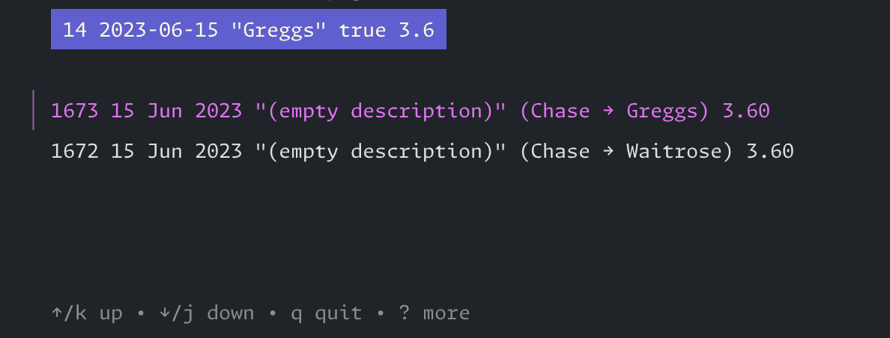

# gdpr

This repository contains a collection of command-line tools to assist with parsing financial statements provided by banks and converting them into transactions compatible with Firefly-III, an open-source personal finance manager.

> [!WARNING]
> This was not originally written to be shared and makes lots of assumptions, many of which I have forgotten I made. It's not expected to work out of the box for you yet, though improvements may be made in the future. It should serve as a useful starting point for writing or modifying to create your own scripts.

## Tools

- [cmd/firefly](cmd/firefly/main.go): Fetch data, link transactions, and match transactions from CSV files to existing Firefly transactions.

	- `match` transactions from CSV to existing Firefly transactions  
    

	- `link` transactions to another  
    (identifies partial reimbursement where defined on notes)
  
	- `version` retrieved from Firefly  
    (confirms authentication and connection to Firefly API)

	- `fetch` from the given path  
    (makes authenticated request to Firefly API and returns response)

- [cmd/barclays](cmd/barclays/main.go): Parses Barclays microfiche statements and outputs them in CSV format, ready for the Firefly command.

- [cmd/reexport](cmd/reexport/main.go): Reformats Firefly export data into a more user-friendly CSV format.

> [!TIP]
> If you don't know where to start,
>
> ```sh
> go run ./cmd/firefly --help
